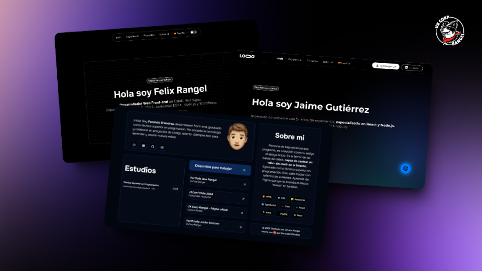

# 🦄 Dev Portfolios

A unique collection of developer portfolio templates. Get a professional, modern and customizable portfolio, highlight your projects, your experience and stand out in the tech world with impressive designs.

## 📖 Table of Contents

- [🙌 Motivation](#-motivation)
- [👀 Features](#-features)
- [📦 Stack](#-stack)
- [✨ Templates](#-templates)
- [🦄 Unicorn Sparkle](#-unicorn-sparkle)
- [🔮 Mistical Unicorn](#-mistical-unicorn)
- [❤️ Community Templates](#-community-templates)
- [🌈 Rainbow Unicorn](#-rainbow-unicorn)
- [🤝 Contribute](#-contribute)
- [📈 Activity](#-activity)
- [📄 License](#-license)

## 🙌 Motivación

[Jordan Wooding][baymax], creator of [Full-Stack Developer][web-application], designed this collection of portfolios as a tribute to the community that helped her develop her [portfolio][portfolio]. Ana decided to give back with templates that any developer can use to enhance their own portfolio. Not only do these templates reflect her creativity and expertise, but they are also an accessible tool for other developers to highlight their projects and skills in a professional manner.

## 👀 Features

- ⭐ Modern and customizable design.
- 🖥️ Responsive design for different screen sizes.
- 🌎 Available for multiple languages.
- 🚀 Up-to-date dependencies.
- ⚡ Focus on performance.
- 🌗 Support for light and dark theme.

## 📦 Stack

- 🚀 [Astro](https://astro.build/) - The web framework for content-driven websites.
- 🏷️ [Typescript](https://www.typescriptlang.org/) - JavaScript with type syntax.
- 💅 [Sanitize.css](https://github.com/csstools/sanitize.css) - A collection of CSS reset styles.

## ✨ Templates

### [🦄 Unicorn Sparkle][unicorn-sparkle-folder]

[![Unicorn Sparkle][unicorn-sparkle-screenshot]][unicorn-sparkle-folder]

[![Lighthouse Performance Badge][performance-badge]][pagespeed]
[![Lighthouse Accessibility Badge][accessibility-badge]][pagespeed]
[![Lighthouse Best Practices Badge][best-practices-badge]][pagespeed]
[![Lighthouse SEO Badge][seo-badge]][pagespeed]

#### 🔗 Links

[![Unicorn Sparkle Design][figma-badge]][figma]
[![Unicorn Sparkle Website][demo-badge]][demo]

#### 🤔 How to use?

To use the [Unicorn Sparkle][unicorn-sparkle-folder] template you can copy and run the following command in your terminal:

With NPM:

```bash
npm create astro@latest
```

With PNPM:

```bash
pnpm create astro@latest
```
    
Then go into your portfolio folder, install the dependencies and that's it! 🎉.

[👉 Read more][unicorn-sparkle-folder]

### [🔮 Mystical Unicorn][mystical-unicorn-folder]

> [!IMPORTANT]
> 🚧 Under construction 🚧

## ❤️ Community Templates

#### 📦 Stack

- ⚡ [Vite](https://vitejs.dev/) - Rapid authoring tool that powers the next generation of web applications.
- ⚛️ [React](https://react.dev/) - JavaScript library for building user interfaces.
- 💅 [CSS](https://lenguajecss.com/css/) - Style language for web pages.
- 🏷️ [Typescript](https://www.typescriptlang.org/) - JavaScript with type syntax.

#### 🤔 How to use?

To use the [Rainbow Unicorn][rainbow-unicorn-folder] template you can copy and run the following command in your terminal:

Then go into your portfolio folder, install the dependencies and you're done! 🎉.

### 👀 Other templates

Find out who is using or was inspired by this collection of templates to create their own portfolio.

####  Vanilla

## 🤝 Contribute

If you would like to contribute to this project, you can do so by reading the [Contribution Guide](./CONTRIBUTING.md).

## 📄 License

This project uses the MIT License. See the [License File](./LICENCE) for more information.

---

Designed with ❤️ by [Jordan Wooding][jordan] and developed with 💙 by [baymax][bay].

[LinkedIn]: https://www.linkedin.com/in/jordan-wooding-75053a338
[Portafolio]: https://github.com/bossbaby-baymax/Portfolio-js
[Github]: https://github.com/bossbaby-baymax